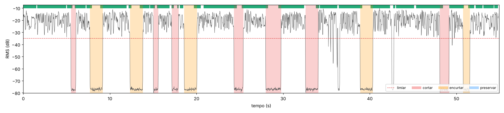
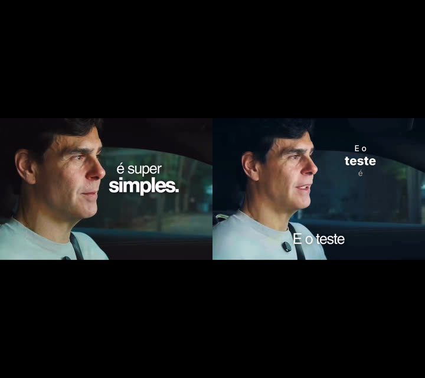
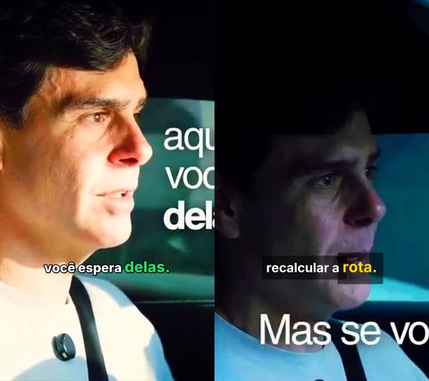
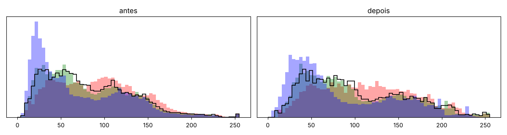
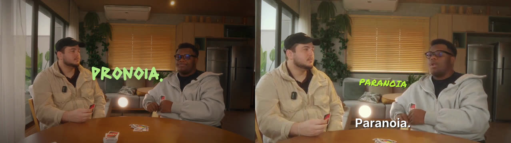
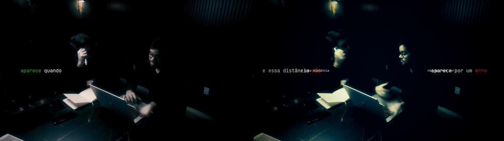
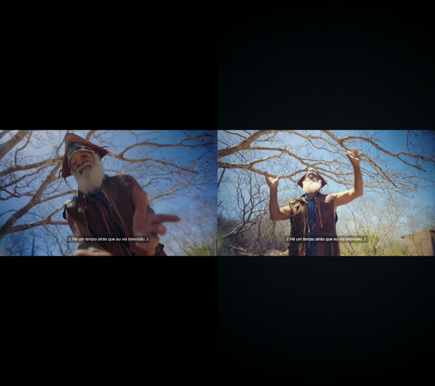

# Resultados por etapa (Etapas 2–13)

Ambiente de teste: Linux, 4 vCPU, sem GPU, Python 3.13, FFmpeg 6.1.
Material de teste: os 5 vídeos de referência. Eles **já vêm editados** (sem pausas, com legendas
queimadas e trilha). Para testar o corte de silêncio, `tests/make_raw_test.py` gerou "brutos sintéticos"
(`bruto_ref1`, `bruto_ref3`) com pausas reais de 0,25–1,8 s e ruído de sala inseridas entre as frases.
**Nas imagens abaixo, as legendas grandes da fonte são as que já estavam queimadas nos vídeos de referência.**
Em um vídeo bruto real elas não existem.

## Etapa 2 — Dependências

`python -m editor.doctor` → tudo ✔ (FFmpeg com libass/lut3d/loudnorm/xfade/deesser; numpy, scipy, OpenCV,
librosa, noisereduce, pyloudnorm, sherpa-onnx, faster-whisper, spaCy + pt_core_news_sm, colour-science,
Pillow, matplotlib, MoviePy, OpenColorIO, pydub).

Ferramentas buscadas no GitHub (licenças permissivas, ativas):

| Necessidade | Repositório | Licença | Por quê |
|---|---|---|---|
| ASR offline PT com timestamps | k2-fsa/sherpa-onnx (+ modelo NVIDIA Parakeet TDT 0.6B v3) | Apache-2.0 / CC-BY-4.0 | HuggingFace bloqueado neste ambiente; 25 s de áudio em ~2 s na CPU |
| Detecção de rosto | opencv/opencv_zoo (YuNet) | MIT | modelo de 230 KB, roda no cv2 sem dependências extras |
| Fontes | rsms/inter, JetBrains/JetBrainsMono, google/fonts | OFL / Apache | Inter replica a tipografia das refs 1–3; mono replica a ref5 |

Pontos de atenção:
- MediaPipe foi testado e descartado: os modelos dele são baixados de um host bloqueado aqui.
- Manim e Remotion não foram necessários (ver README).
- Freesound e Pixabay estão inacessíveis neste ambiente. Por isso o banco de trilhas (10 faixas, 5 humores) e de SFX (16 efeitos em 5 categorias) foi **sintetizado** por `editor/assets_gen.py`.

## Etapa 3 — Silêncios (bruto_ref3: 13 pausas inseridas)

- 12/13 pausas detectadas. A que ficou de fora tem 0,25 s, abaixo do mínimo de 0,4 s, como esperado.
- O vídeo foi de 54,9 s para 45,3 s.
- Ações aplicadas: 6 pausas cortadas e 6 encurtadas (preservadas com 0,45 s) por contexto. Motivos registrados: "transição de tópico", "frase de revelação a seguir" e "ênfase após a pausa".
- Problema encontrado e corrigido: o Parakeet emite o token de pontuação *dentro* da pausa, o que esticava a palavra anterior. Corrigi isso e o modo híbrido passou a usar a energia para as bordas e o ASR só como veto.
- Com trilha de fundo na fonte (refs originais), o modo híbrido percebe que a energia não é confiável e passa a usar só a transcrição. Isso fica registrado no log.

## Etapa 4 — Técnicas de corte (contagem por execução final)

| Vídeo / estilo | jump zoom | smash | L-cut | J-cut | match | reaction | beat | transição |
|---|---|---|---|---|---|---|---|---|
| bruto_ref1 / referencia1 | 11 | 1 | 2 (+1 recusado) | 1 | 0 | – | 1 | – |
| bruto_ref3 / viral_reels | 11 | – | 1 | – | – | – | – | 1 whip |
| ref2 / referencia2 | 2 | 1 | 1 (+1 recusado) | 1 | 2 | 2 | – | – |
| ref4 / documentario | – | 1 | 1 (+1) | 0 (+2 recusados) | – | 1 | 3 | – |
| ref5 / brand_dark | – | 1 | 2 (+1) | – | 6 | 1 | – | 2 flash |

*ref2 e ref4 foram rodados antes da correção do match cut (Etapa 13); os demais, depois.*

- "Recusado" significa que a técnica foi detectada, mas cairia no mesmo plano com o rosto visível. Aplicá-la deixaria a boca fora de sincronia, então fica registrada no relatório com o motivo e não é aplicada.
- Bug corrigido na Etapa 13: o match cut dava similaridade 1,00 sempre. O proxy de 4 fps arredondava os dois lados do corte para o mesmo frame. Depois da correção, o ref5 caiu de 34 para 6 match cuts, e só entre planos de composição realmente parecida (histograma ≥ 0,90 e rosto a ≤ 0,10 de distância).
- O modo sugestão e a revisão foram validados: desativar técnicas no YAML e mudar a ação de uma pausa é respeitado na execução seguinte. As decisões são casadas pelo tempo na fonte, então continuam válidas mesmo quando os cortes de silêncio mudam.

## Etapa 5 — Legendas

| | |
|---|---|
|  | **referencia2** (esq.: ref3 original; dir.: pipeline). Legenda no espaço vazio ao lado do rosto, palavra-chave em ExtraBold maior, linhas regulares, palavra ainda não dita em cinza. |
|  | **viral_reels**: karaoke com a palavra atual em verde e caixa semitransparente com keyword amarela. Os estilos alternam a cada 7 s ou a cada troca de tópico (48 blocos em 5 estilos). |

## Etapa 6 — Cor

Exemplo do `referencia1` (bruto_ref1):
- Luma média foi de 0,324 para 0,397 e os percentis 0,5/99,5 de 0,04/0,83 para 0,08/0,92, com pretos levemente levantados como no ref1.
- A correção primária ajusta, por plano, o balanço de branco (ganhos ≤ 18%), o gamma, os níveis e o tom de pele. No ref3, um plano tinha a pele 22° fora da skin tone line e foi corrigido em 50%.
- Depois vem a LUT `quente_ref1` (33³, colour-science).

## Etapa 7 — Áudio

| Execução | LUFS integrado | True peak | Meta |
|---|---|---|---|
| todas as 6 | **-14,0** | -1,1 a -1,3 dBTP | -14 LUFS / ≤ -1 dBTP ✔ |

Cadeia aplicada:
- noisereduce
- passa-altas de 90 Hz
- remoção de hum (só quando detectado)
- de-esser
- EQ: -2,5 dB em 300 Hz, +2,5 dB em 4 kHz, +1,5 dB de shelf em 10 kHz
- compressor 3:1
- normalização da voz em -16 LUFS
- mix
- loudnorm em 2 passes + limiter

## Etapas 8–9 — SFX e trilha

- **SFX:**
  - O whoosh é posicionado com o pico de energia exatamente no corte.
  - Há impacto no smash cut (ex.: "Paranoia." no bruto_ref1, com hit + corte de 0,5 s na trilha) e "ding" em frases com gatilho de atenção.
  - Limites respeitados: no mínimo 2,5 s entre efeitos e no máximo 10 por minuto.
  - Match cuts não recebem whoosh, para continuarem invisíveis.
- **Trilha:**
  - O humor vem do tom detectado: emocional para ref1, informativo/energético para ref3, sombrio para ref5.
  - Há troca de faixa a cada 60–90 s, com crossfade equal-power de 2,5 s.
  - Ducking de -14 dB sob a voz (ataque 80 ms, release 450 ms), +até 3 dB nos trechos de maior energia.
  - Os beat cuts movem o corte em ±180 ms até o beat forte.

## Etapa 10 — Motion graphics

| | |
|---|---|
|  | **Callout de conceito**: o termo definido na fala vira título manuscrito verde com animação pop, como o "PRONOIA" do ref1. O ASR transcreveu "Paranoia"; a correção é feita pelo glossário `transcricao.correcoes: {Paranoia: Pronoia}`. |
|  | **brand_dark**: mono dividido esquerda/direita com keyword colorida, low-key teal & orange, flash branco nas trocas de tópico, grão e vinheta. |
|  | **documentario**: legenda de cinema com fundo cinza, grão, vinheta, look terroso e beat cuts. |

Também implementados: lower third (aparece quando o orador se apresenta ou quando o nome está no YAML), contador animado para números ≥ 10, gancho de abertura, B-roll por palavra-chave e moldura de película.

## Etapa 11 — Desempenho (4 vCPU)

| Execução | Duração final | Tempo total | Maior etapa |
|---|---|---|---|
| bruto_ref3 → reels **preview** (360x640) | 45 s | ~33 s | composição |
| bruto_ref3 → reels final (1080x1920) | 45 s | ~4 min | render dos segmentos (reframe + upscale) |
| bruto_ref1 → youtube final (1920x1080) | 61 s | ~4,5 min | composição final |

O preset do x264 passou de `slow` para `medium` na Etapa 13, o que reduz o tempo de exportação em cerca de 2x com perda de qualidade imperceptível.

## Etapa 13 — Ajustes feitos a partir da revisão visual

1. **Remoção automática de tarjas pretas** embutidas na fonte (cropdetect). Sem isso, o reframe tratava as tarjas como imagem.
2. **Legendas largas reduzidas automaticamente** para caber em 88% da largura. Antes, "CONFIAR NAS PESSOAS" saía da tela.
3. **Legendas virais maiores** (68 → 82 px) e estilo lateral maior (50/76 → 62/104 px).
4. **Match cut corrigido** (amostragem do proxy) e com critério mais rígido.
5. **Movimento medido pela mediana**: um único salto de frame deixou de contar como gesto.
6. **Histograma "depois"** passou a recortar só a área de conteúdo, sem as tarjas.
7. **Nova regra de callout**: termo isolado seguido de definição.
8. **Glossário de correção do ASR** (`transcricao.correcoes`).
9. **Revisão casada pelo tempo na fonte**, estável quando os cortes mudam.

## O que ainda depende de você (limitações honestas)

- **B-roll / inserts de filme.** São o maior diferencial das refs 1, 2, 4 e 5. Coloque clipes em `assets/broll/` nomeados pela palavra-chave.
- **Trilhas e SFX reais.** O banco sintetizado valida o pipeline, mas soa como sintetizador simples. Troque por uma biblioteca royalty-free.
- **Resolução da fonte.** 720p reenquadrado para 9:16 perde nitidez. Grave em 1080p/4K, ou use `layout.modo: letterbox` como no estilo `referencia2`.
- **Smash cut, revelação e clímax são heurísticos.** Para vídeos importantes, use `--modo sugestao` e aprove as decisões.
